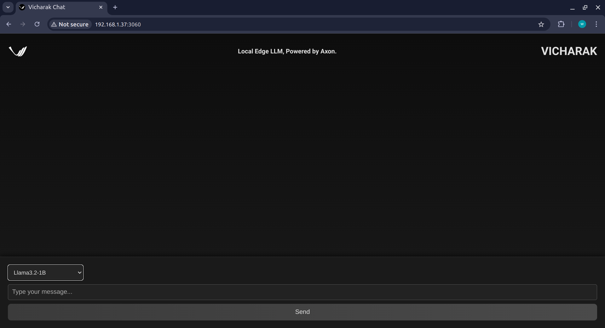
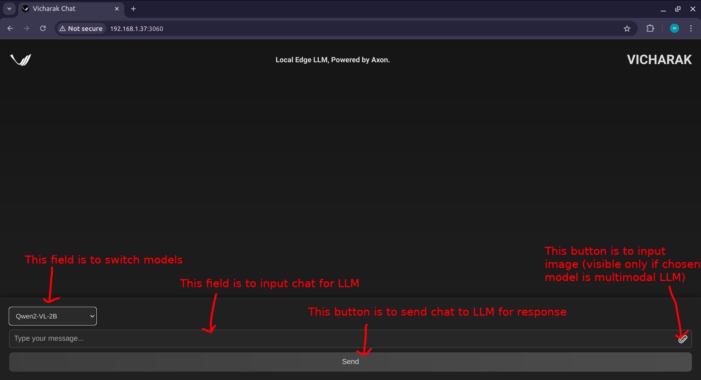
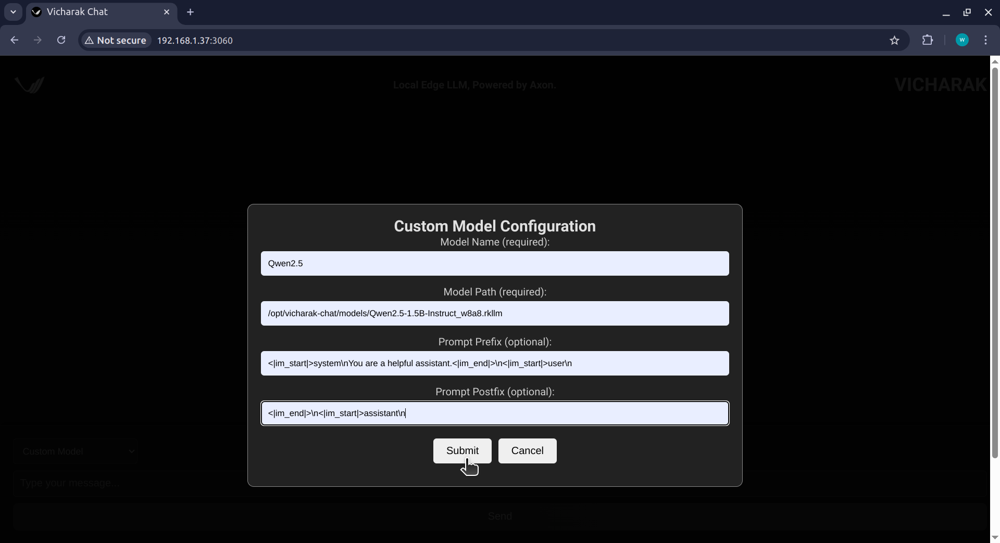

# Vicharak-Chat: LLM Chat Interface for Axon SBCs

Vicharak-Chat is a streamlined solution designed exclusively for Axon SBCs, powered by the RK3588 chip. It enables users to run large language models (LLMs) efficiently on the device's NPU. With Vicharak-Chat, users can transform their Axon SBC into a powerful AI conversational system.

### Key Features:

- **Effortless Setup**: Packaged as a `.deb` file for easy installation and deployment.
- **Optimized Performance**: Harnesses the Axon SBC's NPU to deliver high-efficiency LLM inference.
- **Interactive Front-End**: A web-based interface accessible via `localhost:<port>` for seamless interaction with deployed LLMs.
- **Interactive Console-mode**: A terminal based interactive chat with LLMs

## Steps to setup:

- update apt package list using `sudo apt update`
- check if NPU driver version >= 0.9.8 using `sudo cat /sys/kernel/debug/rknpu/version`
  - if driver version < 0.9.8, update the kernel as follows
  - check kernel version using `uname -r`
  - if kernel version is 5.\*.\* , then run `sudo apt install linux-image-5.10.230-axon`
  - else if kernel version is 6.\*.\*, then run `sudo apt reinstall linux-image-6.1.75-axon linux-headers-6.1.75-axon`
  - after updating kernel reboot Axon with command `sudo reboot`
  - you can optionally remove older kernel(s)
- install vicharak chat by running: `sudo apt install vicharak-chat`
- to remove and free up space run `sudo apt remove vicharak-chat`
- in future to update vicharak-chat to get latest feature, run:  
    `sudo apt update`  
    `sudo apt reinstall vicharak-chat`


## Usage of app:  

Enter command `vicharak-chat` in terminal to run with default configurations.

### Command Line Arguments To Alter Configurations

This program accepts the following command-line arguments:

- `--top_k <int>`: Sets the `top_k` parameter, which controls the number of highest-probability options considered during sampling (e.g., `--top_k 5`).

- `--top_p <float>`: Sets the `top_p` parameter, which enables nucleus sampling by considering the smallest set of tokens with a cumulative probability greater than `p` (e.g., `--top_p 0.8`).

- `--temperature <float>`: Adjusts the randomness of predictions by scaling logits before applying softmax (e.g., `--temperature 0.7`).

- `--repeat_penalty <float>`: Penalizes the model for repeating the same token excessively (e.g., `--repeat_penalty 1.1`).

- `--frequency_penalty <float>`: Penalizes tokens based on their frequency in the text so far (e.g., `--frequency_penalty 0.1`).

- `--presence_penalty <float>`: Penalizes tokens based on whether they appear in the text at all (e.g., `--presence_penalty 0.1`).

- `--max_new_tokens <int>`: Specifies the maximum number of new tokens to generate (e.g., `--max_new_tokens 256`).

- `--max_context_len <int>`: Sets the maximum context length for the model (e.g., `--max_context_len 512`).

- `--skip_special_token <bool>`: Determines whether to skip special tokens in the output. Use `true` or `false` (e.g., `--skip_special_token true`).

- `--socket_port <int>`: Sets the socket port used for communication (e.g., `--socket_port 8080`).

- `--frontend_port <int>`: Sets the frontend port for connecting the frontend interface (e.g., `--frontend_port 3060`).

- `--list_models`: List all readily available locally or on server (e.g., `--list_models`).

- `--console_run <string>`: Set to use console for interaction with mentioned model, pass model name(available models can be checked using --list_models) or full path to rkllm model  (e.g., `--console_run Llama3.2-1B`).

- `--prompt_prefix <string>`: Add prefix to user input string for model specific prompt (default: \"\", make sure you enter entire prompt inside double inverted comma).

- `--prompt_postfix <string>`: Append postfix to user input string for model specific prompt (default: \"\", make sure you enter entire prompt inside double inverted comma).
                    
- `--launch_frontend`: Sets to launch frontend automatically (e.g., `--launch_frontend`).

- `--log_inputs`: Enables logging of input data for debugging purposes.

- `--log_outputs`: Enables logging of output data for debugging purposes.

- `--boost_mode`: Sets the frequencies of system resources at max, to use this app should be run as root or with sudo.

- `--version` or `-v`: Displays the version of installed vicharak-chat.

- `--help`: Displays the help message, listing all available options and their descriptions.

To see a quick summary of these options, you can run:

```bash
vicharak-chat --help
```

### For interaction with LLMs via terminal only

To run vicharak-chat in terminal mode,:  
Enter command: `vicharak-chat --console_run <model_name_or_full_path>`   
Available models' name can be seen by entering `vicharak-chat --list_models` command  

For custom prompt prefix and postfix, that is needed to be added to the user input, there is `--prompt_prefix` and `--prompt_postfix` command line argument  
Example usage: `vicharak-chat --console_run path_to_custom_model/model.rkllm --prompt_prefix "<|im_start|>system\nYou are a helpful assistant.<|im_end|>\n<|im_start|>user\n" --prompt_postfix "<|im_end|>\n<|im_start|>assistant\n"`  

To exit the app, enter `/exit` in place of user input.

While LLM is still generating output, to interrupt and stop it, press `ctrl+c` **only once** to stop it.

To switch model, enter `/switch` in place of user input. Then it will ask for model name or complete path to rkllm model. Enter that and model will be switched.


### For interaction with LLMs via frontend

Run `vicharak-chat` in terminal to launch vicharak-chat backend and frontend server on Axon.

If you have display connected to Axon and want to launch vicharak-chat in browser of Axon automatically while running vicharak-chat, run as `vicharak-chat --launch-frontend`

By default frontend port is set as 3060, and socket port for communication between frontend and backend is set as 8080.  
These can be changed using command line arguments as: `vicharak --frontend_port 5050 --socket_port 6060`  
Above command will change frontend port to 5050 and socket_port to 6060.  

After running vicharak-chat, to connect to vicharak-chat frontend, enter url "http://<axon_ip_address_or_localhost_if_browser_on_axon>:<frontend_port>/?socket_port=6060"  
If socket_port is not modified through command line argument, you can simply enter url as "http://<axon_ip_address_or_localhost_if_browser_on_axon>:<frontend_port>"

Now after entering correct frontend url, frontend should look like:  


Usage of various fields are as mentioned in the image below:  


While selecting model you can select option `custom model` to interact with your own rkllm model.  
Example usage way to use custom model:  



For instructions regarding how to compile your LLM model to run with vicharak-chat, please checkout [Axon-NPU-Guide](https://github.com/vicharak-in/Axon-NPU-Guide?tab=readme-ov-file#how-to-convert-llm-models-from-huggingface-or-gguf-file-to-rkllm-format-and-run-on-axon)